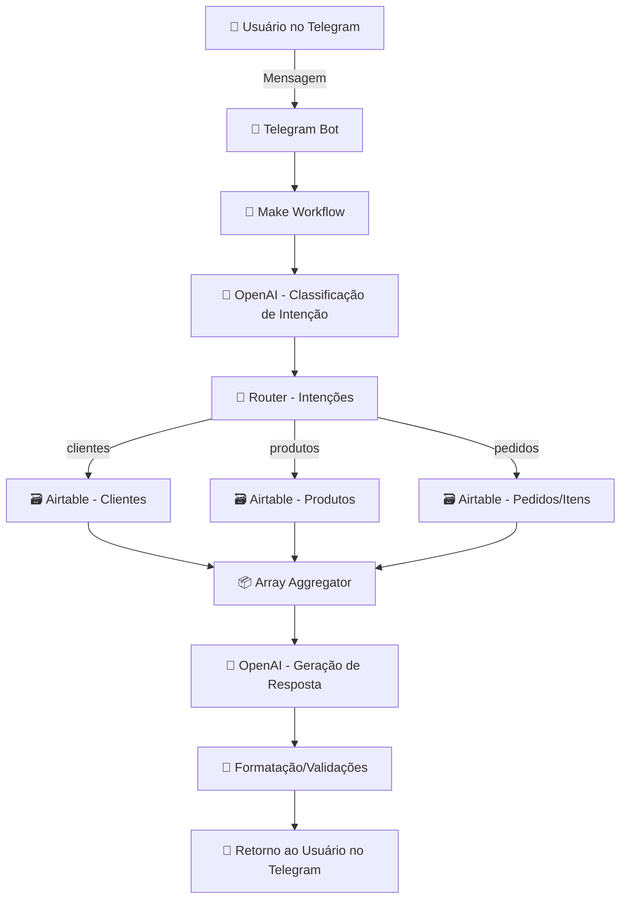
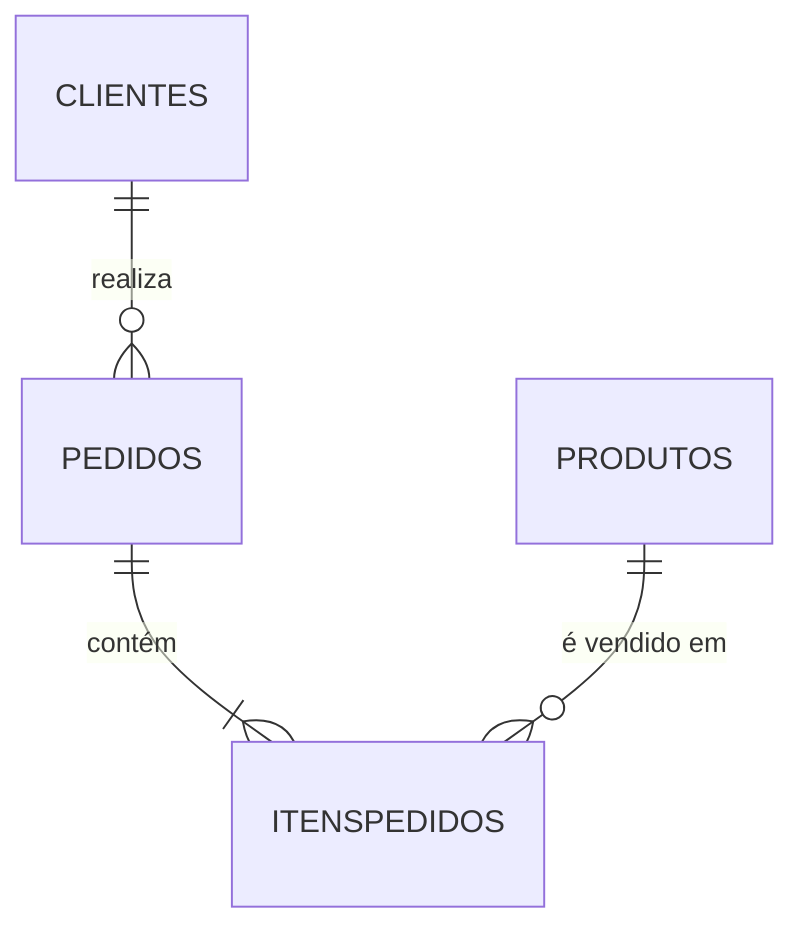

# 🤖 Chatbot de Análise de Vendas com IA Generativa

> **Stack:** Telegram Bot · Make (Integromat) · OpenAI (GPT) · Airtable  
> **Objetivo:** democratizar o acesso a dados de vendas via conversa em linguagem natural — **sem SQL, sem BI complexo**.

---

## 🎯 Visão Geral do Projeto

Este projeto entrega um **BI conversacional**: usuários de negócio fazem perguntas no **Telegram** e recebem **insights instantâneos** a partir do **Data Warehouse no Airtable**, com a **orquestração** do **Make** (low‑code/serverless) e **IA Generativa** (OpenAI) para **classificação de intenção** e **geração de respostas**.

### ✨ Problema x Solução

| 🚨 Problema de Negócio | ✅ Solução Implementada |
|---|---|
| Demora na geração de relatórios | Respostas **instantâneas** via chatbot |
| Ferramentas de BI complexas | **Interface conversacional** no Telegram |
| Custo alto de análises | **Automação low‑code** com Make + Airtable |
| Dados subutilizados | Dados brutos viram **insights acionáveis** |

---

## 🧱 Arquitetura e Stack

| Camada | Ferramenta | Função |
|---|---|---|
| Interface | **Telegram Bot** | Entrada de perguntas / entrega de respostas |
| Orquestração | **Make (Integromat)** | Workflow, roteamento e integração entre APIs |
| IA Generativa | **OpenAI (GPT)** | 1) Classificar intenção · 2) Gerar resposta de negócio |
| Data Warehouse | **Airtable** | Tabelas: Clientes, Produtos, Pedidos, ItensPedidos (SSOT) |

### 📐 Diagrama de Arquitetura



---

## 🔄 Workflow – Etapas Técnicas

1) **📲 Telegram → Make (Webhook/Trigger do Bot)**  
2) **🧠 OpenAI (Node 1)** classifica **intenção** (`clientes|produtos|pedidos`) a partir do texto.  
3) **🔀 Router** direciona para o nó Airtable correto **(consulta mínima necessária)**.  
4) **🗃️ Airtable** retorna registros filtrados (ex.: top N, período, status).  
5) **📦 Array Aggregator** consolida resultados em JSON único.  
6) **🧠 OpenAI (Node 2)** transforma dados **em resposta de negócio curta e objetiva**.  
7) **💬 Telegram** recebe a resposta já formatada (negrito, listas, moeda).

---

## 🗄️ Modelo de Dados (Airtable)

- **Clientes** (id, nome, segmento, …)  
- **Produtos** (id, nome, preço, categoria, …)  
- **Pedidos** (id, cliente_id, data, status, total, …)  
- **ItensPedidos** (pedido_id, produto_id, qtde, preço_unit, …)  



> **Métricas suportadas:** receita, ticket médio, top N clientes/produtos, volume por período/segmento, status de pedidos, etc.

---

## 🧠 Engenharia de Prompts (OpenAI)

### 1) **Classificação de Intenção** (Node 1)

**System Prompt** (resumo):
```
Você é um classificador de intenções para dados de vendas.
Devolva um JSON compacto com {"intencao": "<clientes|produtos|pedidos>"}.
Não explique.
```

**User Prompt** (exemplo):
```
Pergunta do usuário: "{{texto}}"
Responda apenas com JSON no formato:
{"intencao": "<clientes|produtos|pedidos>"}
```

### 2) **Geração de Resposta** (Node 2 – por fluxo)

**System Prompt** (exemplo – clientes):
```
Você é um analista de vendas. Receberá um array de objetos com nome e gasto_total.
Produza uma frase curta ranqueando os top N em moeda BRL (pt-BR). Sem rodeios.
```

**User Prompt**:
```json
[{"nome": "Luana", "gasto_total": 10222.12}, {"nome": "Juliana", "gasto_total": 7812.29}]
```

**Output esperado:**
```
Top 2 clientes por faturamento: Luana (R$ 10.222,12) e Juliana (R$ 7.812,29).
```

> **Boas práticas:** delimite escopo, padronize formato de saída, peça JSON quando for alimentar nós subsequentes.

---

## 🧩 Exemplos Práticos (Make)

### Parse de JSON (quando a saída do LLM vem como string)
```
{{ JSON.parse( $json["output"] ).intencao }}
```

### Formatação final (Markdown para Telegram)
```
*Top 3 produtos por receita*
1) {{ $json.produtos[0].nome }} — R$ {{ $json.produtos[0].receita }}
2) {{ $json.produtos[1].nome }} — R$ {{ $json.produtos[1].receita }}
3) {{ $json.produtos[2].nome }} — R$ {{ $json.produtos[2].receita }}
```

### Filtros por período
- Parametrizar `data_inicial`/`data_final` via mensagem (“… no último mês?”) e aplicar filtro no Airtable.

---

## 🔐 Segurança & Custos

- **Airtable API Key** com escopos mínimos: `data.records:read`, `data.records:write`, `schema.bases:read`.  
- **Rate limiting**: cache de respostas comuns e *throttling* no Make.  
- **Custo de IA**: prompts curtos, *few-shot* enxuto, compressão de arrays antes de enviar ao GPT.  
- **Privacidade**: evite dados sensíveis/pessoais no prompt (PII masking).

---

## 🧪 Ice Breakers (Onboarding no Bot)

- “📊 Qual produto foi o mais vendido este mês?”  
- “👥 Liste os 5 clientes com maior ticket médio.”  
- “💰 Qual a receita total do último trimestre?”  
- “📦 Quantos pedidos estão em processamento?”  

---


## 🚀 Resultado Final

- Respostas **instantâneas** e **com contexto de negócio**.  
- **Acesso universal** via Telegram (sem curva de aprendizado).  
- **Arquitetura low‑code escalável**, custo‑eficiente e governável.  
- **Insights acionáveis** que destravam valor em minutos, não dias.

---

## ▶️ Como Rodar (resumo)

1. Crie um **Bot do Telegram** (BotFather → obtenha o token).  
2. Gere **API Key do Airtable** e configure escopos adequados.  
3. Configure **OpenAI API Key** no Make.  
4. Importe/crie o **workflow** no Make com os nós acima.  
5. Configure **webhook/trigger** do bot → aponte para o workflow.  

---

## 🧠 Conclusão

Este projeto demonstra **senioridade em Engenharia de Dados e Regras de Negócio** aplicadas à **IA Generativa**:  
- design modular e governável,  
- prompts engenheirados,  
- otimização de custos/latência,  
- e foco em **experiência do usuário**.  


